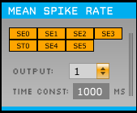

# Mean Spike Rate Plugin

This [Open Ephys](https://open-ephys.atlassian.net/wiki/spaces/OEW/pages/491527/Open+Ephys+GUI) plugin estimates the mean spike rate over time and channels. Uses an exponentially weighted moving average to estimate a temporal mean (with adjustable time constant), and averages the rate across selected spike channels (electrodes). Outputs the resulting rate onto a selected continuous channel (overwriting its contents).

## Installing:

This plugin can be built outside of the main GUI file tree using CMake. In order to do so, it must be in a sibling directory to plugin-GUI\* and the main GUI must have already been compiled.

If you are already using CMake to build the *main GUI* (in development as of writing), you should switch to the `cmake-gui` branch to get the compatible plugin CMake build file.

See `MeanSpikeRate/CMAKE_README.txt` and/or the wiki page [here](https://open-ephys.atlassian.net/wiki/spaces/OEW/pages/1259110401/Plugin+CMake+Builds) for build instructions.

\* If you have the GUI built somewhere else, you can specify its location by setting the environment variable `GUI_BASE_DIR` or defining it when calling cmake with the option `-DGUI_BASE_DIR=<location>`.

## Usage:

* Place the plugin somewhere after a Spike Sorter or Spike Detector. 

* After adding some single electrodes, stereotrodes, and/or tetrodes, you should see corresponding toggle buttons show up in the top section. These can be selected/deselected to include/exclude them in the average. The output is divided by the number of spike channels selected, so two identical spike channels should produce the same output whether one of them or both are selected.

* In the "Output:" combo box, select a continuous channel on which to output the average.

* Change the time constant, if desired. This is defined as the period over which the average decays by a factor of 1/e.
